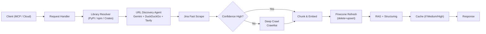
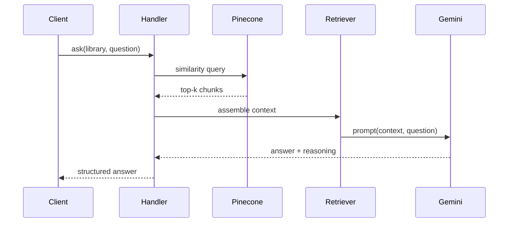

# Librarian

“Your personal AI librarian that never stops searching for the documentation you need.”

> Status: Core ingestion + self‑correcting pipeline + cloud + stdio MCP integration working. Ongoing: broader MCP feature surface & editor plugins.  
> License: (none yet—add one before public release)

## TL;DR
Give me a library name (PyPI / npm / crates.io). I:  
1. Discover the richest real docs page (not a thin homepage)  
2. Fast-scrape via Jina AI  
3. If weak → deep crawl with Crawl4ai  
4. Embed & refresh Pinecone (cosine, 768D)  
5. Run RAG + confidence scoring  
6. Serve structured results via:  
	 - Local MCP (stdio) server (`mcp_stdio_server.py`)  
	 - Cloud endpoints (`/process_library`, `/ask`) at `LIBRARIAN_CLOUD_URL`

---

## 🔧 Implemented Capabilities

- Multi‑ecosystem resolution (PyPI, npm, crates.io)
- Intelligent documentation URL selection (Gemini 1.5 Flash + search)
- Fast initial content extraction (Jina AI Reader)
- Confidence scoring + conditional deep crawl fallback (Crawl4ai)
- Deep multi‑page aggregation
- Vector refresh (delete old → upsert new) in Pinecone serverless:
	- Index: `mcp-documentation-index` (cosine, dim=768, us-east-1)
- Gemini reasoning & structured summarization
- Cache gated by confidence (Medium/High only)
- Dual operation modes: Local MCP stdio + Cloud HTTP service

## 🧱 Architecture Overview

### High-Level Data Flow
1. Request (MCP stdio or Cloud HTTP)
2. Ecosystem metadata fetch
3. Candidate docs discovery (Gemini + DuckDuckGo + Tavily fallback)
4. Initial scrape (Jina)
5. Content quality + confidence evaluation
6. (Optional) Deep crawl (Crawl4ai)
7. Chunking + Embedding
8. Pinecone index refresh
9. RAG + structuring
10. Response + optional cache

### Core Components

| File | Responsibility |
|------|----------------|
| `config.py` | Env loading, constants (index name), Pydantic schemas |
| `services.py` | Tools (ecosystem lookups, search, scraping), pipeline stages, embeddings, RAG |
| `main.py` | Orchestrates one full ingestion run locally |
| `agent.py` | Legacy/simple launcher |
| `mcp_stdio_server.py` | MCP stdio adapter exposing actions |
| `.vscode/mcp.json` | Local MCP client configuration |
| `requirements.txt` | Dependencies |
| `.env` | Local secrets (never commit real values) |

### Conceptual Data Models
- LibraryRequest { name, ecosystem? }
- LibraryMetadata { name, version?, homepage?, candidates[] }
- PageContent { url, raw_text, source(jina|crawl4ai), quality_score }
- Chunk { id, library, text, embedding }
- LibraryInfo { library_name, summary, documentation_url, confidence_score, additional_insights }
- AskAnswer { answer, citations[], confidence }

---

## 🗺️ Mermaid Diagrams

### Flow


### Sequence (Ask)


---

## 🧠 Discovery Strategy

- Reasoning model: `gemini-1.5-flash`
- Search order: Ecosystem metadata → DuckDuckGo queries → Tavily fallback
- URL scoring heuristics: Penalize marketing roots; prefer pages with heading density, code blocks, versioned paths; reject empty stubs.

## 🧪 Confidence & Fallback

| Stage | Trigger |
|-------|---------|
| Deep Crawl | Confidence Low/Unknown OR text below length threshold |
| Re-embed | Always after deep crawl |
| Cache | Only Medium / High |
| Ask pre-processing | If not indexed → run pipeline first |

---

## 🧰 Toolchain / Services

| Concern | Choice |
|---------|--------|
| Reasoning & extraction logic | Gemini 1.5 Flash |
| Embeddings (768D) | Gemini embeddings endpoint |
| Fast scrape | Jina AI Reader |
| Deep crawl | Crawl4ai (`crawl4ai-setup` installs Chromium) |
| Search | DuckDuckGo (primary), Tavily (fallback) |
| Vector store | Pinecone serverless (cosine) |
| Protocols | MCP stdio, Cloud HTTP |
| Runtime | Python 3.11 |

---

## ⚙️ Environment Variables

(Do NOT commit real key values. Rotate any leaked keys immediately.)

```
GEMINI_API_KEY=your_gemini_key
GEMINI_MODEL=gemini-1.5-flash
PINECONE_API_KEY=your_pinecone_key
PINECONE_INDEX=mcp-documentation-index
PINECONE_REGION=us-east-1
TAVILY_API_KEY=your_tavily_key
LIBRARIAN_CLOUD_URL=https://librarian-ai-agent-...run.app/
# Optional / future:
# CACHE_DIR=.cache/librarian
```

If you still have `GOOGLE_API_KEY` logic, keep it; remove if unused.

---

## 📦 Installation (Local)

```cmd
pip install -r requirements.txt
crawl4ai-setup
```

`crawl4ai-setup` handles Playwright + Chromium; no manual `playwright install` needed.

Create `.env` (never commit real values).

---

## ▶️ Local Pipeline Run

If `main.py` supports args:
```cmd
python main.py --library tokio --ecosystem crates
```
Otherwise edit the target inside `main.py` and:
```cmd
python main.py
```

---

## 🔌 MCP (Local Stdio)

`.vscode/mcp.json` points to `mcp_stdio_server.py`.

Example (conceptual inside AI-enabled editor):
```
process_library: { "library_name": "tokio" }
ask: { "library_name": "tokio", "question": "How do I create a TCP server?" }
```

---

## ☁️ Cloud HTTP Mode

Base: `${LIBRARIAN_CLOUD_URL}`

Endpoints:
- `POST /process_library`
	```json
	{ "library_name": "tokio" }
	```
- `POST /ask`
	```json
	{ "library_name": "tokio", "question": "How to use async TCP?" }
	```

Python example:
```python
import os, requests
BASE = os.environ["LIBRARIAN_CLOUD_URL"].rstrip("/")

r = requests.post(f"{BASE}/process_library", json={"library_name":"tokio"})
print(r.json())

q = requests.post(f"{BASE}/ask", json={
		"library_name":"tokio",
		"question":"Show a minimal async TCP server example."
})
print(q.json())
```

(If adding auth later, include an `Authorization: Bearer <token>` header.)

---

## 🔍 Troubleshooting

| Symptom | Cause | Resolution |
|---------|-------|-----------|
| Very short summary | Thin initial page | Deep crawl auto-triggers; re-run if still low |
| Crawl errors | Chromium missing | Re-run `crawl4ai-setup` |
| Pinecone auth failure | Wrong key/region/index | Verify env values |
| Repeated Low confidence | Poor URL selection | Refine heuristics / add denylist |
| Slow first run | Chromium + warm start | Subsequent runs faster |
| MCP stdio not spawning | Wrong Python path | Fix `.vscode/mcp.json` command |

---

## 🧩 Extending Ecosystems

1. New resolver (API call + candidate docs extraction)  
2. Integrate into discovery ranking  
3. Optional heuristics tuned per ecosystem  
4. Reuse ingestion + fallback unchanged  

---

## 🔐 Security & Hygiene

- Remove any real keys from history; rotate compromised keys.  
- Ensure `.env` is in `.gitignore`.  
- Plan authentication for public cloud endpoints.  
- Avoid logging raw page content in production (use sampling).  

---

## 🚧 Roadmap (Condensed)

| Horizon | Focus |
|---------|-------|
| Short | Solidify MCP surface, answer grounding |
| Mid | VS Code & Neovim plugins, improved relevance scoring |
| Long | Dependency conflict prediction, community doc quality signals |

---

## 📝 License

None yet—add one (e.g., MIT or Apache-2.0) before external contributions.

---

## 🤝 Future Contributing Guidelines (Planned)

- Include reproducible test run output for new ecosystems
- Avoid committing secrets
- Provide small fixture datasets for deterministic tests

---

## 📜 Example End-to-End (`tokio`)

```
process_library(tokio)
 → discovery selects https://docs.rs/tokio
 → jina scrape (enough?) if not → deep crawl
 → vectors refreshed (Pinecone cosine 768D)
 → structured summary (confidence: High)

ask(tokio, "How do I spawn tasks?")
 → retrieve top-k → Gemini synthesis with source context
```

---

## ✅ Summary

Librarian delivers a resilient, self-correcting documentation ingestion + RAG stack with dual local (MCP stdio) and cloud operation modes, leveraging Gemini + Jina + Crawl4ai + Pinecone to keep results fresh and high quality.
